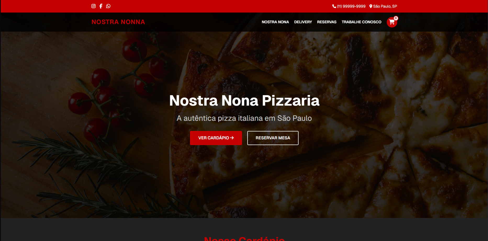

# 🍕 Nostra Nona Pizzaria

[](https://nostra-nona.vercel.app)
[](https://reactjs.org/)
[](https://nextjs.org/)
[](https://www.typescriptlang.org/)
[](https://tailwindcss.com/)

## 📋 Sobre o Projeto

Site oficial da Nostra Nona Pizzaria, a autêntica pizza italiana em São Paulo. Este projeto foi desenvolvido com tecnologias modernas para proporcionar uma experiência de usuário excepcional.

## 🖥️ Demonstração

[](https://nostra-nona.vercel.app)

[Visite o site](https://nostra-nona.vercel.app)

## ✨ Funcionalidades

- 🍽️ Cardápio digital interativo
- 📅 Sistema de reservas online
- 🚚 Pedidos para delivery
- 💼 Área para candidatura de empregos
- 🎁 Programa de fidelidade

## 🛠️ Tecnologias Utilizadas

- **Frontend**: React, Next.js, TypeScript
- **Estilização**: Tailwind CSS
- **Deploy**: Vercel
- **Gerenciamento de Estado**: Context API
- **Formulários**: React Hook Form

## 🚀 Como Executar o Projeto

```bash
# Clone este repositório
git clone https://github.com/seu-usuario/nostra-nona.git

# Acesse a pasta do projeto
cd nostra-nona

# Instale as dependências
npm install

# Execute a aplicação em modo de desenvolvimento
npm run dev

# A aplicação será aberta na porta:3000 - acesse http://localhost:3000
```

## 🤝 Contribuição

Contribuições são bem-vindas! Sinta-se à vontade para verificar a página de issues ou enviar um pull request.

## 📝 Licença

Este projeto está sob a licença MIT. Veja o arquivo [LICENSE](LICENSE) para mais detalhes.

## 📞 Contato

Nostra Nona Pizzaria - [contato@nostranona.com.br](mailto:contato@nostranona.com.br)

CNPJ: 30.303.209/0001-95

Rua da Pizza, 1004 - São Paulo, SP

Telefone: (11) 5051-1229 | WhatsApp: (11) 94023-8329
